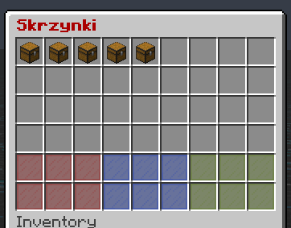
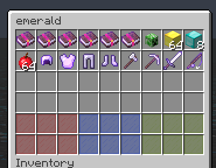
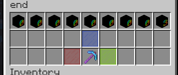
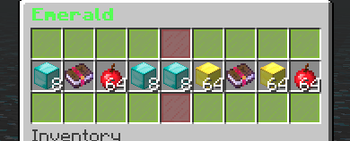

# Spigot Case Opener Plugin
This is my little spigot plugin for the server TheOtherCraft.pl  
This is literally cs:go plugin  
## Case Editor
It shows only case it is basic menu  
  

## Case Editor Inside of case
Inside of case you can add items and look at them and their individual chances  
  

## Case Editor Item and weight editor
It has skull base editing system to edit item weight with nice gui  
And nice blue glass info which provides basic info on chance of drop and everything else    
  

## Case opening
Plugin is based on opening cases like in cs:go it has a look and feeling of opening real case but in minecraft  
   

# TODO
- Config file for modyfing names
- Fix StackOverflow with opening case and force closing it